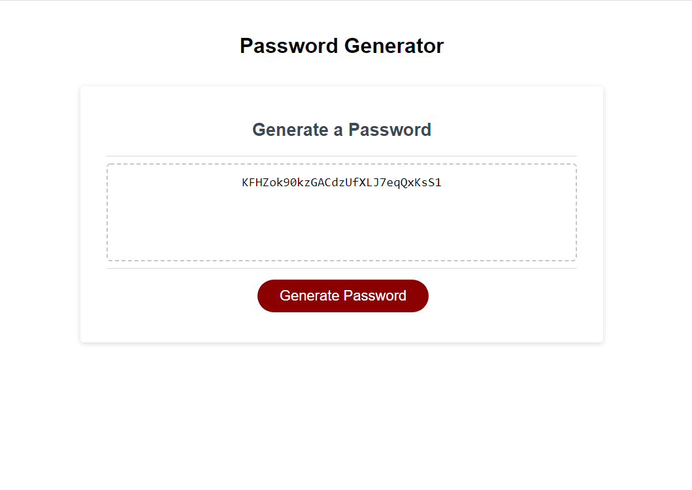

<h1 align="center">Strong Password Generator 🚀</h1>

<p align="center">
    
    
    
    
</p>
<p align="center">
    
    
    
</p>

## 📓 Description

A Strong Password Generator using javaScript, HTML and CSS.

## 🎬 Screenshot



## 🃏 User Story

```
AS AN employee with access to sensitive data
I WANT to randomly generate a password that meets certain criteria
SO THAT I can create a strong password that provides greater security
```

## ✔️ Accpetance Criteria

```
GIVEN I need a new, secure password
WHEN I click the button to generate a password
THEN I am presented with a series of prompts for password criteria
WHEN prompted for password criteria
THEN I select which criteria to include in the password
WHEN prompted for the length of the password
THEN I choose a length of at least 8 characters and no more than 128 characters
WHEN asked for character types to include in the password
THEN I confirm whether or not to include lowercase, uppercase, numeric, and/or special characters
WHEN I answer each prompt
THEN my input should be validated and at least one character type should be selected
WHEN all prompts are answered
THEN a password is generated that matches the selected criteria
WHEN the password is generated
THEN the password is either displayed in an alert or written to the page
```

## 📋 Table of Contents

- [Description](#description)
- [Screenshot](#screenshot)
- [User Story](#user-story)
- [Acceptance Criteria](#acceptance-criteria)
- [Table of Contents](#table-of-contents)
- [Installation](#installation)
- [Usage](#usage)
- [Contributing](#contributing)
- [Questions](#questions)

## 🛠 Installation

`git clone https://github.com/hugh-bowie/password-generator.git`

## ▶️ Useage

- Follow the propmts to tweak your password specifications.

## 🍻 Contributing

:octocat: [Hugh Bowie](https://github.com/hugh-bowie)

## ⁉️ Questions

Contact me with any questions: [hughbowie@me.com](mailto:hughbowie@me.com)<br />[GitHub](https://github.com/hugh-bowie)<br />
